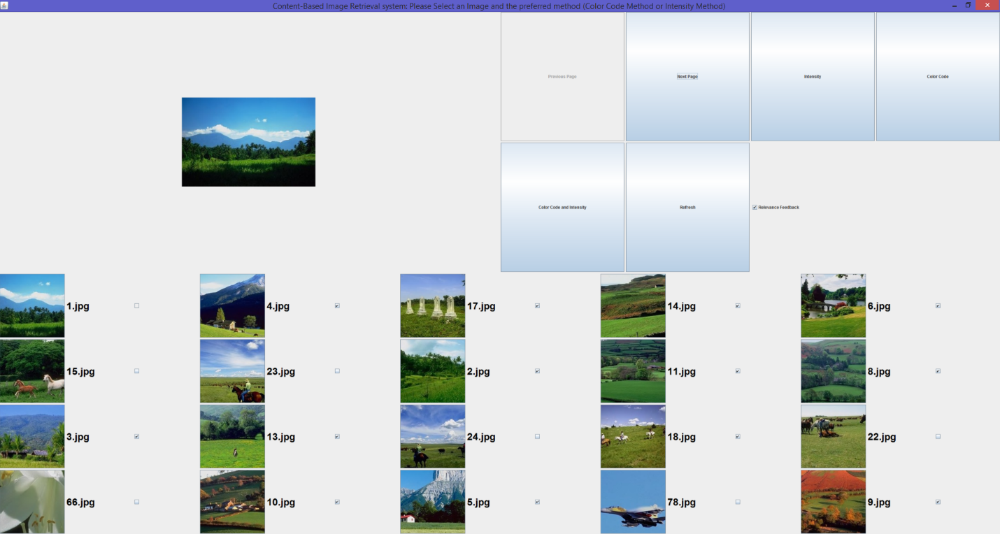

CSS 584 A Wi 20: Multimedia Database Systems

Student Name: Ahmed Nada

Student ID #: 1875772

Assignment #2 submission report

- How to run your program

Option 1:

1.  Open the submitted project in your IDE then build, compile and run
    the CBIR.java file.

{width="6.076388888888889in"
height="5.618055555555555in"}

Option 2 using the submitted CBIR.jar file:

On your command prompt: cmd

Navigate to the location of the myCBIR.jar file then execute it using
java -jar myCBIR.jar

**[Important note: make sure the images directory is in the directory as
the .jar file, otherwise, the .jar file will not run.]{.mark}**

• How to use your system with step-by-step instructions

Once the application is running:

1.  Please select the query image by clicking on it and make sure it
    appears in the upper left panel.

2.  Click on the color code intensity button, once clicked on that
    button for the first time. You will now be able to enable the
    Relevance feedback using the check box.

{width="6.493055555555555in"
height="3.9305555555555554in"}

3.  After the first iteration the Relevance feedback checkbox will be
    enabled

{width="6.5in" height="4.214583333333334in"}

4.  Select the Relevance feedback button so the check boxes of the
    images will start to appear.

[Note: in the relevance feedback iterations, the very first picture will
always be the query image, its check box is greyed out because it will
be included in the set of selected images anyway so no need to re-select
it]{.mark}.

{width="6.5in" height="3.5194444444444444in"}

- Screen dumps to show the first page of retrieval results for **query
  image 1.jpg** using relevance feedback with **first 3 iterations**,
  and corresponding **precision values for first page** of results in
  each iteration

Image 1 query using intensity + color code

Initial result (before doing RF, with relevant image selected which will
be used for RF analysis):

{width="6.5in" height="3.4791666666666665in"}

After the initial color code + intensity run, images that are very
similar to the query image are images in sequence number 1 (query
image),2,4,5,8,9,11,12,13,14,17,18,19, since they are all greenery
scenes with a upper part representing blue sky so can be considered as
true positives. Hence, the precision is 13/20 = 0.65 (65%). Considering
precision of the user-provided relevance feedback, in which user checked
9 images that are relevant, then the precision would be 9/20=0.45 (45%).

After activating the relevance feedback and selecting the relevant
images

{width="6.486111111111111in"
height="3.4583333333333335in"}

1^st^ iteration result (1^st^ RF analysis results, with new relevant
images are selected for 2nd RF analysis):

{width="6.493055555555555in" height="3.625in"}

In the above pictures, I believe the relevant images that matches the
query images greenery + some part of blue sky are
1,2,3,4,5,6,7,9,10,11,14,15,16,17,18,19 so 16/20=0.8 (80%). Considering
the selected images by the user for the feedback, it will be 13/20=0.65
(65%).

2^nd^ iteration result + selected relevant images for the 3^rd^
iteration :

{width="6.485416666666667in"
height="3.4506944444444443in"}

In the above picture the relevant images are
1,2,3,4,5,7,8,9,10,11,12,13,15,16,17,18,19, hence, precision is
17/20=0.85 (85%). If we consider the ones selected by the user, then the
precsion will be 14/20=0.7 (70%).

3^rd^ iteration page 1:

{width="6.495138888888889in"
height="3.470138888888889in"}

In the above picture, I see the relevant images are all except 19 and 16
so precision is 18/20=0.9 (90%).

3^rd^ iteration page 2:

{width="6.495138888888889in"
height="3.4555555555555557in"}

Looking at the iteration results from my application and from the
provided ExampleResults_image1Query and all images match except that I
have 2 additional images (image 23 and image 24).

• Discuss the similarity and differences between our simplified RF
algorithm and the RF framework proposed in \[Rui98\] (the paper is on
Canvas Files/ReadingList). You may start the discussion by re-drawing
Fig.2. in \[Rui98\] to reflect our simplified algorithm and followed by
explanations (you may also refer to equations in \[Rui98\] to discuss
what we've used, skipped, and/or revised). This part should be at least
1 page long (single-spaced, 11 font size, page margins: top & bottom
1'', left & right 1.25'').

{width="6.493055555555555in"
height="7.208333333333333in"}

In the simplified relevance feedback method used in this assignment, we
have used the resulting color code and intensity matrices after
normalizing them. After which, the resultant matrixes were concatenated
together to form one bigger feature matrix composed of 89 features (25
intensity features + 64 color code features). After getting the
resultant 89 features matrix, we calculated the average and standard
deviation of each feature to be used to calculate the Gaussian
normalization. Gaussian normalization is better that the regular
normalization since the feature information will not be wrapped into a
small narrow range (equation (13)).

In the query part of the simplified algorithm, we used the feature
matrix of the selected query image, and then concatenated the features
representations of the relevant images selected by user in the relevant
feedback iterations.

In Contrast to the representation matrix of \[Rui98\]'s implementation,
in which the algorithm uses multiple representation vectors r11 - rij to
describe each feature, our simplified algorithm makes the representation
matrix in the same dimension as the feature matrix, so much less
complexity and less computations. For example, the representation used
in \[Rui98\]'s can consist of multiple representation for different
features representing the images like color, texture, shape, etc. Both
simplified relevance feedback algorithm and \[Rui98\] algorithm utilize
the main idea of using the user's relevance feedback to the query point
to update the weights of the features based on the user's subjective
decision.

The main difference between \[Rui98\]'s and our simplified relevance
feedback, is on the weight matrices. In the algorithm of \[Rui98\],
there are 3 weight vectors, distributing the weights of each layer of
the algorithm W1 -- Wi, W11 -- Wij and W111 - Wijk. And the weights are
inter-related regarding finding the similarities: The intra-similarity
is first calculated with the intra-weights and a similarity measurement
such as Manhattan distance or Euclidean distance can be used to
calculate the similarity. We can then calculate the inter-similarity,
which is the connection from features to the used representations by
using the inter-weight. Finally, we can have the overall similarity
using the previous inter-similarity and the Wi.

In the used simplified algorithm, we have only one weight matrix
calculated using the standard deviation of relevant image feature
matrix. The simplified relevance feedback we used is initializing the
weights by giving each feature an equal weight at the beginning then
letting the user feedback manipulate how the weights will be adjusted
based on the feedbacks from multiple iterations (equation (5) in
\[Rui98\] paper). Also, the similarity updates are based on the feature
weights so that each feature can contribute to the similarity between 2
different objects based on the weight of that feature (equation (7) and
(8)).

Another major difference is the way of updating weights and how the
feedback is getting provided. In our simplified algorithm, user can only
get to state whether an image is relevant of not while in Rui98
algorithm, the user can give a feedback from a range of available values
which gives the user a better range of subjectivity. The inter-weight is
updated using the relevance feedback provided by the user. Score (RT)
can be represented by 3 (highly relevant), 1 (relevant), 0 (no opinion),
-1 (non-relevant) and -3 (highly non-relevant).

This allows for having a more precise weight to user's preference. Then
we can add user's score into the weight with a conditional function and
update the inter-weight. Intra-weight matrix is updated in the same
manner as our simplified algorithm. It is updated by using the standard
deviation σ. Since the weight is inversely proportional with the
standard deviation so the weight will be W=1/ σ (equation 2). After
getting the updated weight, the weight will be normalized by dividing it
by the sum of weights.

Reference

\[1\] Rui, Yong, et al. \"Relevance feedback: a power tool for
interactive content-based image retrieval.\" IEEE Transactions on
circuits and systems for video technology 8.5 (1998): 644-655.
